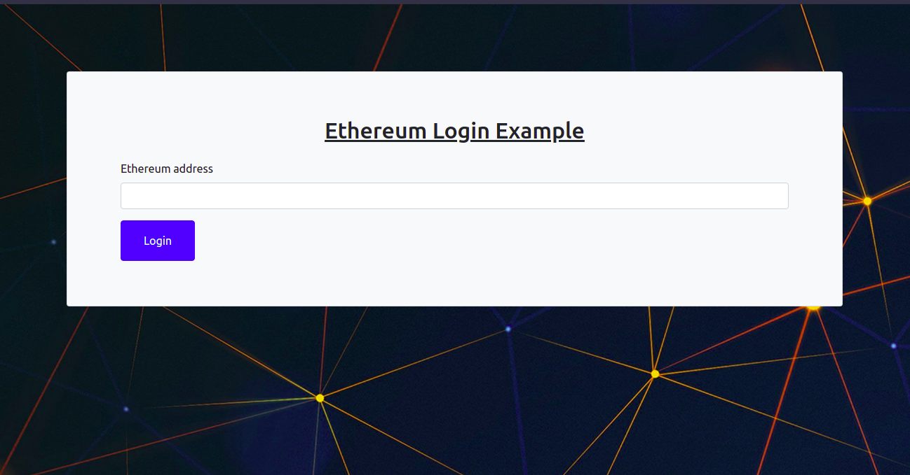
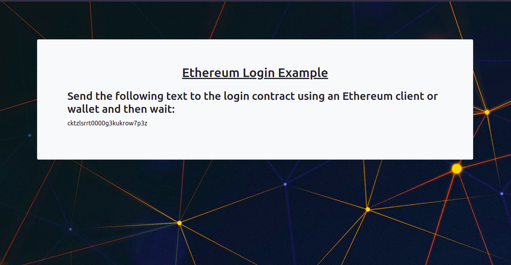
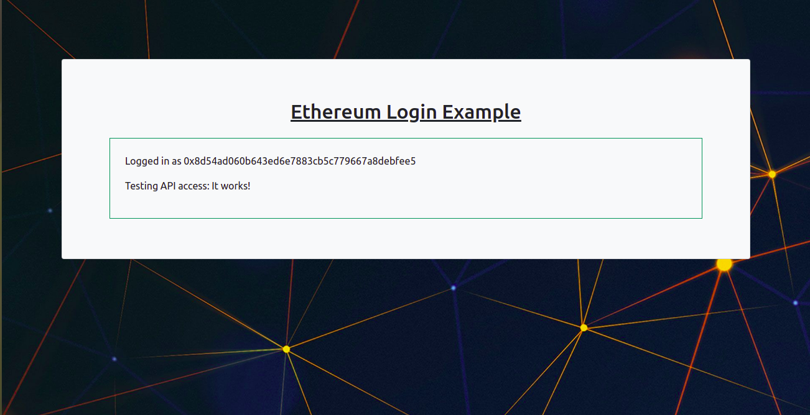

<h1 align="center">Welcome to EthLogin 👋</h1>

  
  

> A PoC that uses Ethereum addresses and the concept of public key cryptography to devise a challenge based authentication system.

## Screens

1. Login Page.

2. Challenge Page.

3. API Testing Page (with JWT).

## Author

👤 **Shubhankar K Gupta**

* Website: https://shubhankarkg.github.io/ShubhankarKG_profile/
* Twitter: [@ShubhankarKG](https://twitter.com/ShubhankarKG)
* Github: [@ShubhankarKG](https://github.com/ShubhankarKG)

## 🤝 Contributing

Contributions, issues and feature requests are welcome! Feel free to check [issues page](https://github.com/ShubhankarKG/EthLogin/issues). You can also take a look at the [contributing guide](./CONTRIBUTING.md).

## Future Plans

1. Accomodate Wallet Account imports.
2. Persistently store JWT, perhaps on `localStorage`.
3. Enable refresh token capabilities.
4. Deploy contract to Ropsten or Rinkeby.

## Show your support

Give a ⭐️ if this project helped you!

## 📝 License

Copyright © 2021 [Shubhankar K Gupta](https://github.com/ShubhankarKG). 
This project is [ISC](./LICENSE) licensed.
